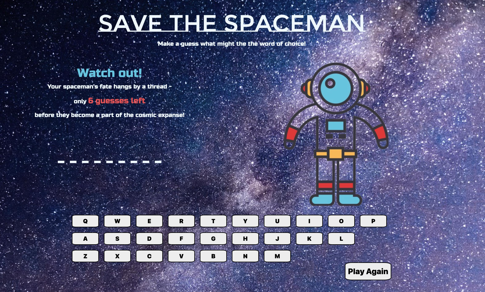
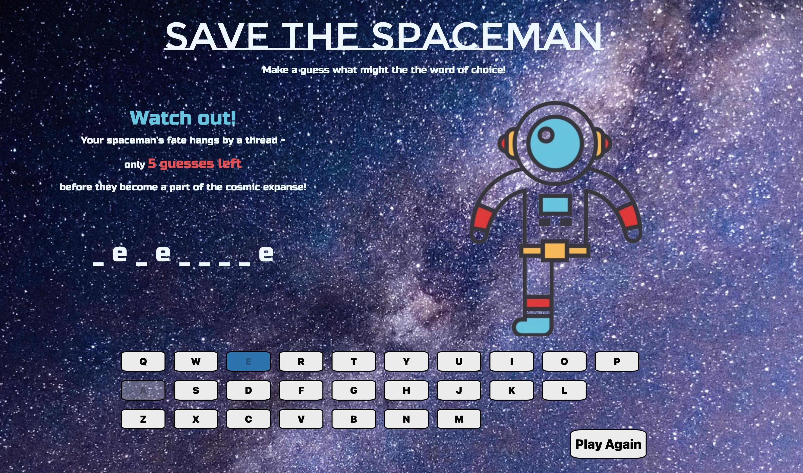
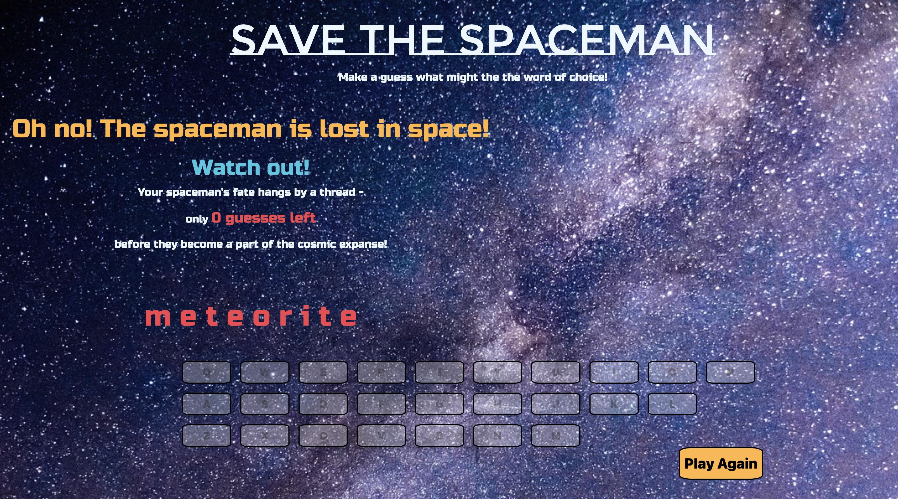
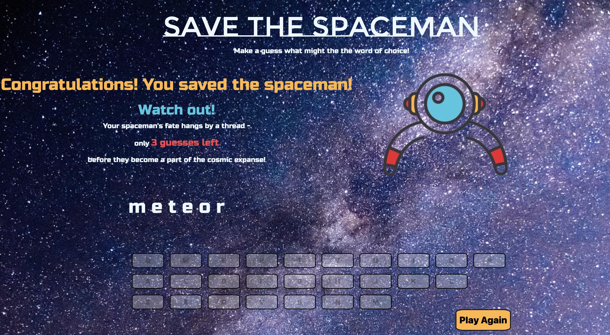

# Spaceman: A Linguistic Odyssey

> Embark on a cosmic journey and unravel the hidden word to save the spaceman. Your challenge is to guess the letters one by one, with each incorrect guess bringing the spaceman closer to the void of space. Exercise your word-solving skills and strategic thinking to rescue the spaceman before it's too late!

---

## Ready to Play?

Begin your cosmic mission: [Launch Game](https://eunjistewart.github.io/spaceman/)

---

## Preview

Take a sneak peek into the spaceman's dilemma:

---

## Technologies Used

- JavaScript
- HTML
- CSS

---

## Getting Started

1. Set course for the game link and step into the cosmos.
   [Begin Your Odyssey](https://eunjistewart.github.io/spaceman/)
2. Strategically select letters to uncover the hidden word.
3. A correct guess unveils part of the word, while each misstep propels the spaceman toward oblivion.
4. You have a mere 6 attempts to complete your linguistic rescue mission!

---

## Future Plans

### (Upcoming Enhancements)

- An expanded collection of space-themed word selections
- immersive sound effects
- Advance CSS animations & transitions

---

##### Created as a Browser-based Game Project By Eunji Lee, 2023

##### Images Credit: https://replit.com/@jim_clark/Spaceman-Images#imgs/

---
